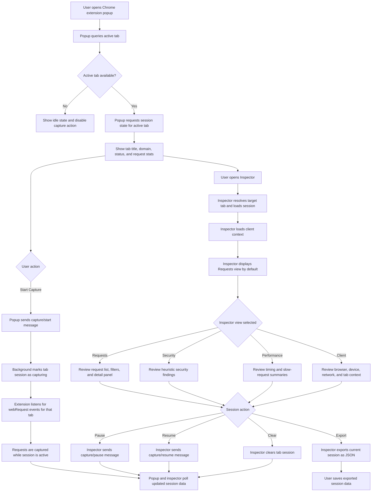

# Application Flow Diagram

This diagram shows the end-to-end user journey through the extension, from opening the popup to capturing traffic and reviewing it in the inspector.

```mermaid
flowchart TD
    A["User opens Chrome extension popup"] --> B["Popup queries active tab"]
    B --> C{"Active tab available?"}
    C -- "No" --> D["Show idle state and disable capture action"]
    C -- "Yes" --> E["Popup requests session state for active tab"]
    E --> F["Show tab title, domain, status, and request stats"]

    F --> G{"User action"}
    G -- "Start Capture" --> H["Popup sends capture/start message"]
    H --> I["Background marks tab session as capturing"]
    I --> J["Extension listens for webRequest events for that tab"]

    J --> K["Requests are captured while session is active"]
    K --> L["Popup and inspector poll updated session data"]

    F --> M["User opens Inspector"]
    M --> N["Inspector resolves target tab and loads session"]
    N --> O["Inspector loads client context"]
    O --> P["Inspector displays Requests view by default"]

    P --> Q{"Inspector view selected"}
    Q -- "Requests" --> R["Review request list, filters, and detail panel"]
    Q -- "Security" --> S["Review heuristic security findings"]
    Q -- "Performance" --> T["Review timing and slow-request summaries"]
    Q -- "Client" --> U["Review browser, device, network, and tab context"]

    R --> V{"Session action"}
    S --> V
    T --> V
    U --> V

    V -- "Pause" --> W["Inspector sends capture/pause message"]
    V -- "Resume" --> X["Inspector sends capture/resume message"]
    V -- "Clear" --> Y["Inspector clears tab session"]
    V -- "Export" --> Z["Inspector exports current session as JSON"]

    W --> L
    X --> L
    Y --> L
    Z --> AA["User saves exported session data"]
```
