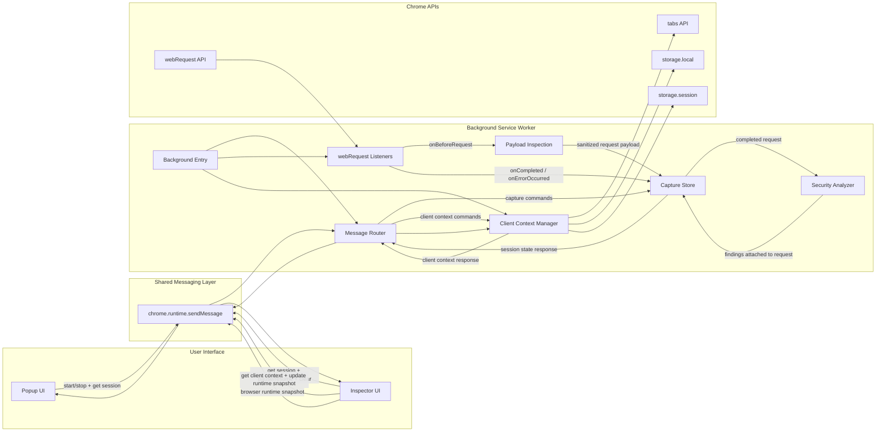

# Logical Flow Diagram

This diagram shows how the extension components interact internally, including popup commands, background processing, tab-scoped session storage, and inspector data retrieval.

## Flow Summary

1. The popup and inspector communicate only through the shared runtime messaging layer.
2. The background service worker acts as the central coordinator for session commands and request capture.
3. `chrome.webRequest` events feed into payload inspection and tab-scoped session storage.
4. Completed requests are passed through heuristic security analysis before being stored for the inspector.
5. Client context is assembled from tab metadata, runtime snapshots, and extension storage.
6. The inspector repeatedly fetches session state and client context to present near real-time updates.
